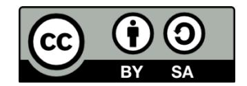

# Preface {.unnumbered}

*Introduction to Human Biology Laboratory Workbook; an Open Education Resource.*\
First Edition © 2024 by George Mateja is licensed under **CC BY‑SA 4.0**.\
To view a copy of this license, visit <https://creativecommons.org/licenses/by-sa/4.0/>.

------------------------------------------------------------------------

## Original Page Numbers {.unnumbered}

| Chapter | Title                 | Page |
|--------:|-----------------------|------|
|       1 | Anatomical Language   | 1    |
|       2 | Use of the Microscope | 30   |
|       3 | Cells                 | 40   |
|       4 | Histology / Tissues   | 73   |
|       5 | Integumentary System  | 95   |

------------------------------------------------------------------------

# Acknowledgments {.unnumbered}

This manual includes original content by **George Mateja**, Professor of Biology at the Community College of Baltimore County. Its creation also contains remixed and revised content from other open educational resources, cited in individual lab attributions.

Special thanks are extended to the following reviewers for their time, expertise, and valuable feedback:

-   Julie Robinson, DC — River Valley Community College\
-   Christine Mirbaha — Community College of Baltimore County\
-   Michael Losinger — Community College of Baltimore County

Gratitude is also extended to the CCBC library staff for their support with copyright and attribution guidance:

-   Jenn Ditkoff — Head Librarian, Dundalk\
-   Jean Boggs — Reference Librarian\
-   Shaune Pyle — OER and Online Learning Librarian\
-   Cheryl Kantorski — Administrative Support Assistant III

This lab manual was written for a one‑semester Anatomy and Physiology course such as **Biology 109: Introduction to Human Biology** at the Community College of Baltimore County.

The completion of this work was supported by a **CCBC Summer Grant (Summer 2024)**. Special thanks to President **Sandra Kurtinitis, Ph.D.** and Provost **Joaquin Martinez, Ph.D.** for their continued support of open educational resources.
